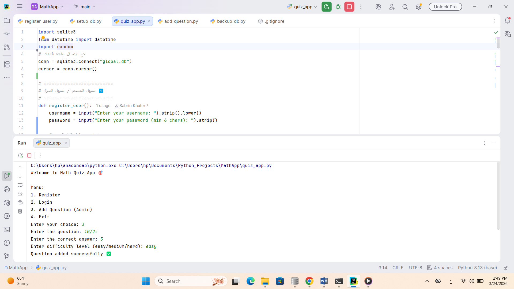

##🎯 Math Quiz App

A simple Math Quiz Application built using Python and SQLite.

##📌 Features
- User Registration & Login system
- Add questions (Admin mode)
- Multiple difficulty levels (easy / medium / hard)
- Score tracking for each user
- SQLite database integration
- Automatic database backup system

##🧠 How it works
1. User registers or logs in
2. Chooses difficulty level
3. Answers math questions
4. Score is calculated and saved

##▶️ How to run the project
1. Open the project in PyCharm or any Python IDE
2. Run the main file:

##🗄️ Database
The app uses SQLite database:
- users → stores usernames and passwords
- questions → stores quiz questions
- scores → stores user scores

## 💾 Backup System
The project automatically creates backups of the database in a separate folder.

## 🚀 Future Improvements
- Add GUI (interface) using Tkinter or PyQt
- Improve validation and error handling
- Add timer for questions
- Add more question categories
## 📸 Screenshot

---

👨‍💻 Developed by: Sabrin Khater
  
